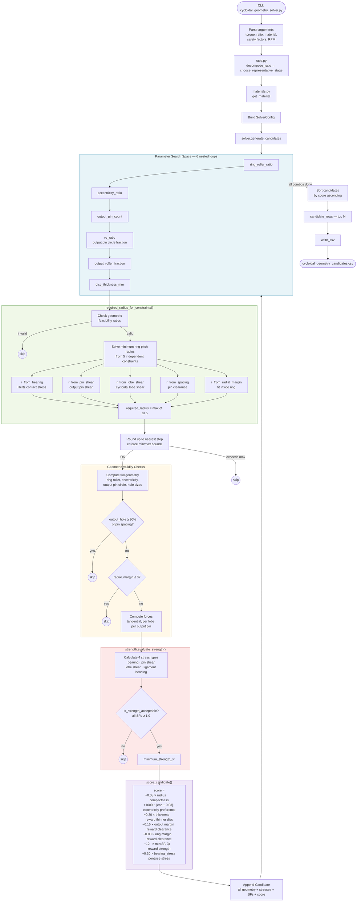

# Cycloidal Drive Sizing — Solver Architecture

## Overview

This tool automatically generates and ranks candidate designs for a cycloidal reduction gear stage. Given a target torque, overall ratio, motor speed, and material, it sweeps a parameter space, enforces geometry and strength constraints analytically, scores each valid candidate, and exports a ranked CSV.

---

## Module Map

```
cycloidal_geometry_solver.py   ← CLI entry point
│
├── ratio.py                   ← decompose overall ratio into stage ratios
├── materials.py               ← material property library (4 presets)
├── models.py                  ← dataclasses: SolverConfig, Candidate, StrengthReport, …
│
└── cycloid/
    ├── solver.py              ← core design generator (main algorithm)
    └── strength.py            ← stress calculations & safety factor checks
```

---

## End-to-End Data Flow



---

## Key Stages Explained

### 1 — Ratio Decomposition (`ratio.py`)

`decompose_ratio()` finds all 1–3 stage combinations whose product equals (or closely approximates) the target overall ratio. `choose_representative_stage()` picks the best single-stage ratio to design for.

### 2 — Parameter Sweep (`solver.generate_candidates`)

Six nested loops span the continuous design space. Every combination of roller ratios, eccentricity, pin counts, circle fractions, and disc thickness is evaluated analytically — no FEA or iteration required.

### 3 — Minimum Radius (`required_radius_for_constraints`)

For a given parameter set, the function derives the minimum ring pitch radius **R** that satisfies five independent constraints simultaneously, each expressed as a closed-form formula:

| Constraint | Driven by |
|---|---|
| `r_from_bearing` | Hertz contact stress limit on output rollers |
| `r_from_pin_shear` | Shear stress across output pin cross-section |
| `r_from_lobe_shear` | Shear of cycloidal disc lobe under tangential force |
| `r_from_spacing` | Minimum clearance between adjacent output pins |
| `r_from_radial_margin` | Output pin circle must fit inside ring roller envelope |

`R = max(all five)` — the tightest constraint governs.

### 4 — Geometry Derivation

With **R** fixed, all absolute dimensions follow directly:

```
ring_roller_radius     = ring_roller_ratio × ring_pin_spacing(R)
eccentricity           = eccentricity_ratio × R
output_pin_circle_r    = ro_ratio × R
output_roller_diameter = output_roller_fraction × output_pin_spacing
output_hole_diameter   = output_roller_diameter + 2×eccentricity + 2×clearance
```

### 5 — Strength Verification (`strength.py`)

Four failure modes are checked. A candidate is rejected if any safety factor falls below 1.0:

| Failure Mode | Formula basis |
|---|---|
| Bearing stress | Projected area contact (force / area) |
| Output pin shear | Solid circular cross-section shear |
| Lobe shear | Disc lobe as a cantilever-shear element |
| Ligament bending | Thin-wall bending of material between output holes |

### 6 — Scoring (`score_candidate`)

A scalar score combines six terms (lower = better). The dominant drivers are:
- **Compactness** — penalises large radius
- **Eccentricity** — softly targets ~3 % of radius
- **Safety factor** — rewards margin above 1.0, saturates at SF = 3

Candidates are sorted ascending; `candidates[0]` is the recommended design.

---

## Output Fields (`Candidate`)

Each row in the CSV contains ~50 fields grouped into four categories:

| Category | Examples |
|---|---|
| Topology | `stage_ratio`, `ring_pin_count`, `lobe_count` |
| Geometry | `ring_pitch_radius_mm`, `eccentricity_mm`, `output_roller_diameter_mm`, `output_hole_diameter_mm` |
| Strength | `bearing_stress_mpa`, `sf_bearing`, `sf_lobe_shear`, `minimum_strength_sf` |
| Performance | `estimated_disc_outer_diameter_mm`, `estimated_output_speed_rpm`, `score` |

---

## Materials (`materials.py`)

| Key | Material | Yield (MPa) |
|---|---|---|
| `4140_qt` | 4140 Q&T Steel | 655 |
| `1045_cd` | 1045 Cold Drawn Steel | 530 |
| `17-4ph_h900` | 17-4PH Stainless H900 | 1170 |
| `7075_t6` | 7075-T6 Aluminium | 503 |

Pass with `--material <key>` on the CLI.
